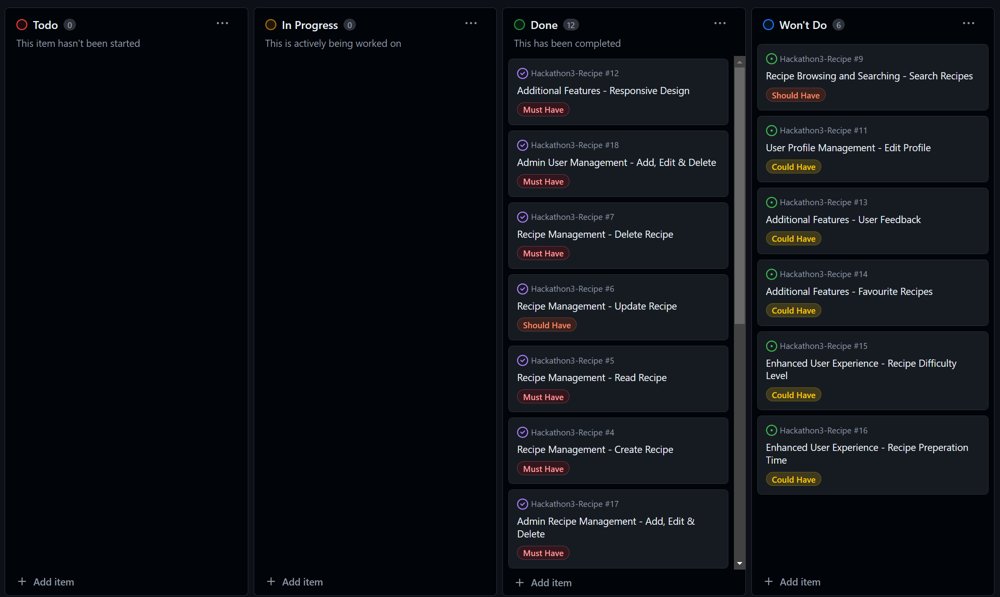

# Welcome to Chings Chaps recipes!
### DevChefs: Brendan, Chris, Jamie, Simon

Here at Ching's Chaps, we serve our users a selection delicious recipes to browse. Registered Users can create, edit and delete chosen dishes. 

Website URL: - https://recipe-app505-77c484b2c0fb.herokuapp.com/

### User Stories

#### As a new user, I want to browse through a list of recipes so that I can discover new dishes to try.

User can see a paginated list of recipes with titles and thumbnails.
User can click on a recipe to view its details.

#### As a new user, I want to register an account so that I can create and manage my recipes.

User can sign up by providing a username, email, and password.
User receives a confirmation email after successful registration.

#### As a user, I want to search for recipes by keyword so that I can find specific recipes quickly.

User can enter keywords in a search bar.
User sees a list of recipes matching the search criteria.

#### As a logged-in user, I want to create a new recipe so that I can share my cooking creations.

User can fill out a form with recipe details including title, ingredients, steps, and an optional image.
User receives a confirmation message upon successful recipe creation.

#### As a logged-in user, I want to view my profile details so that I can see my personal information and recipes.

User can view their username, email, and a list of their created recipes.

#### As an admin, I want to add, edit and delete recipes directly from the admin interface so that I can manage content.

Admin can access the recipe creation form in the admin panel.
Admin can fill out all necessary fields and save the new recipe.
Admin can access the list of recipes in the admin panel.
Admin can edit the details of any recipe and save the changes.
Admin can delete a recipe from the recipe list in the admin panel.
Admin receives a confirmation prompt before deletion.

#### As an admin, I want to add, edit and delete users directly from the admin interface so that I can manage users.

Admin can access the user creation form in the admin panel.
Admin can fill out user details and save the new user.
Admin can access the list of users in the admin panel.
Admin can edit user details and save the changes.
Admin can delete a user from the user list in the admin panel.
Admin receives a confirmation prompt before deletion.
 
 

### Wireframes
These were our lo-fi wireframes

### Workflow
#### Agile Methodology
Agile methodology was used during our collaborative efforts! We used github projects' kanban board and also divided our user stories up so we can manage our tasks mroe efficiently

Our acceptance criterias were included and reflected upon

#### Hackathon 3 Planning
Django requires planning of ERD and  .

We sourced a workflow diagram which is similair to our projects needs. [rachbry](https://github.com/rachbry)

### Models 
This recipe model also resembles our Site model 

|      Name            |     Type                   |     Key  |
|----------------------|----------------------------|----------|
|      user            |     User Model             |     FK   |
|      title           |     CharField              |          |
|      slug            |     CharField              |          |
|      description     |     CharField              |          |
|      instructions    |     RichTextField          |          |
|      ingredients     |     RichTextField          |          |
|      freezable       |     boolean                |          | 
|      serving         |     CharField              |          |
|      image           |     ResizedImageField      |          |
|      image_alt       |     CharField              |          | 
|      Recipe_type     |     CharField  dropdown    |          |
|      Cooking_method  |     CharField  dropdown    |          |
|      posted_date     |     DateTimeField          |          |
 
 

#### Google Fonts Used
- "Poppins" - Paragraphs and smaller text
- "Playwrite NG Modern" - Use for Titles, Headers

#### Colour Pallete from coolers.com
An attractive colour pallet is important. We tried to pick quite bright colours to endow a cheeriness to the site, yet not so bright as to be garish and intrusive.

- #FF6F61 - Bittersweet
- #660900 - Bloodred
- #4A90E2 - Chefchaouen Blue
- #0B2747 - Oxford Blue
- #F5F5F5 - White Smoke
- #333333 - Jet
- #141414 - Night

### Technologies Used
- CSS
- Django
- HTML
- Bootstrap
- Python
- Postgres Database
- git
  
### Credits
- Fontawesome was used for icons
- Google fonts was used
- Wireframes created with Lo-Fi
- chatGPT was used in debugging
