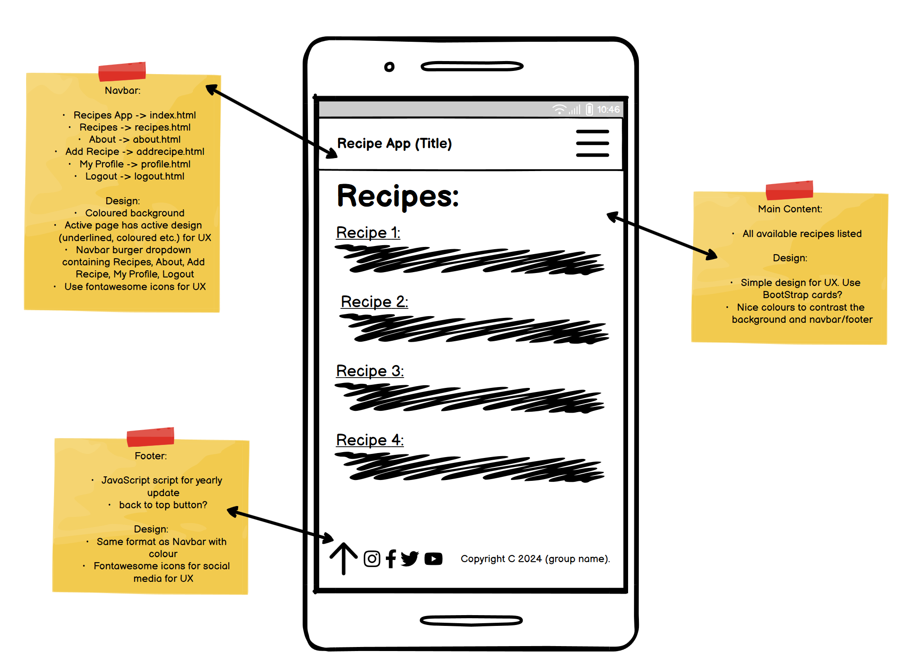

# Welcome to Chings Chaps recipes!
### DevChefs: Brendan, Chris, Jamie, Simon

Here at Ching's Chaps, we serve our users a selection delicious recipes to browse. Registered Users can create, edit and delete chosen dishes. 

Website URL: - https://recipe-app505-77c484b2c0fb.herokuapp.com/

### User Stories

#### As a new user, I want to browse through a list of recipes so that I can discover new dishes to try.

User can see a paginated list of recipes with titles and thumbnails.
User can click on a recipe to view its details.

#### As a new user, I want to register an account so that I can create and manage my recipes.

User can sign up by providing a username, email, and password.
User receives a confirmation email after successful registration.

#### As a user, I want to search for recipes by keyword so that I can find specific recipes quickly.

User can enter keywords in a search bar.
User sees a list of recipes matching the search criteria.

#### As a logged-in user, I want to create a new recipe so that I can share my cooking creations.

User can fill out a form with recipe details including title, ingredients, steps, and an optional image.
User receives a confirmation message upon successful recipe creation.

#### As a logged-in user, I want to view my profile details so that I can see my personal information and recipes.

User can view their username, email, and a list of their created recipes.

#### As an admin, I want to add, edit and delete recipes directly from the admin interface so that I can manage content.

Admin can access the recipe creation form in the admin panel.
Admin can fill out all necessary fields and save the new recipe.
Admin can access the list of recipes in the admin panel.
Admin can edit the details of any recipe and save the changes.
Admin can delete a recipe from the recipe list in the admin panel.
Admin receives a confirmation prompt before deletion.

#### As an admin, I want to add, edit and delete users directly from the admin interface so that I can manage users.

Admin can access the user creation form in the admin panel.
Admin can fill out user details and save the new user.
Admin can access the list of users in the admin panel.
Admin can edit user details and save the changes.
Admin can delete a user from the user list in the admin panel.
Admin receives a confirmation prompt before deletion.
 
 

### Wireframes
To ensure a clean and responsive design, we created wireframes with Lo-Fi. While the finished product does differ from these images in layout, they were still very useful as a guide, and also helped us to envision the finished site from the start.  

 
 

### Workflow
#### Agile Methodology
An agile approach was adopted in the development of this site. We defined themes, which we then turned into user stories, before displaying them on a kanban board. We collaborated effectively in achieving the Minimum Viable Product: in keeping with agile philosophy. Our planning was thorough, including userstories, Capstone project planning, and careful deligation of tasks between devs.

We used Github projects (kanban board) to convert user stories into actionable tasks. The acceptance criteria was very helpful to ensure all necessary tasks were completed.

 
 

#### Capstone Project Planning
Developing with Django requires carefully considered planning due to the many links between apps, models and servers. We used Capstone Project Planning to do this. [Here is a link to the full plan](https://docs.google.com/document/d/11QPEU1c0yT3_XKBcM-x10eRSMHqGLvPuVCXUbpzlJXc/edit).

We used this workflow diagram from [rachbry](https://github.com/rachbry) to get a clear idea of the links between various apps and pages within the front and backend.

 
 

### Models (update the names to ours)
In RecipMe we used the Django AllAuth User Model to create a custom Recipe Model. This includes the following fields:

|      Name            |     Type                   |     Key  |
|----------------------|----------------------------|----------|
|      user            |     User Model             |     FK   |
|      title           |     CharField              |          |
|      slug            |     CharField              |          |
|      description     |     CharField              |          |
|      instructions    |     RichTextField          |          |
|      ingredients     |     RichTextField          |          |
|      freezable       |     boolean                |          | 
|      serving         |     CharField              |          |
|      image           |     ResizedImageField      |          |
|      image_alt       |     CharField              |          | 
|      Recipe_type     |     CharField  dropdown    |          |
|      Cooking_method  |     CharField  dropdown    |          |
|      posted_date     |     DateTimeField          |          |
 
 

### Aesthetics

#### Google Fonts Used
- "Poppins" - Paragraphs and smaller text
- "Playwrite NG Modern" - Use for Titles, Headers

#### Colour Pallete from coolers.com
An attractive colour pallet is important. We tried to pick quite bright colours to endow a cheeriness to the site, yet not so bright as to be garish and intrusive.

- #FF6F61 - Bittersweet
- #660900 - Bloodred
- #4A90E2 - Chefchaouen Blue
- #0B2747 - Oxford Blue
- #F5F5F5 - White Smoke
- #333333 - Jet
- #141414 - Night

 
 

### Testing (make this a link to our results of testing)

Results of manual testing:
[Testing](testing.md)

### Technologies Used
- CSS
- Django
- HTML
- Bootstrap
- Python
- Postgres Database

- GitPod development environment used
- GitHub used for version control and code hosting
- GitHub Projects used for Agile Methodology
  
### Future Development

#### Bugs
We encounted many bugs along the way, a few of which we could not resolve. We would hope to resolve these in future deployments.
[list bugs here]

#### Additional Features
  - Profiles: while we were able to offer the functionality for creating accounts and logging in, we did not have time to implement a full profiles functionality for users. This could include, a profile picture and basic personal info.
  - Suggested recipes functionality: based on a users saved recipes, an algorithm could be used to match similarities between recipes, thereby suggesting new recipes they are likely to enjoy. This, however, would be a great deal more work.
  - Search bar: we unfortunately did not have time to implement a search bar, which would have been some nice functionality to have, and would enhance the user experience significantly. This would be an urgent update in future development

### Credits
- Fontawesome was used for icons
- Google fonts was used
- Wireframes created with Lo-Fi
- chatGPT was used in debugging
  

  

